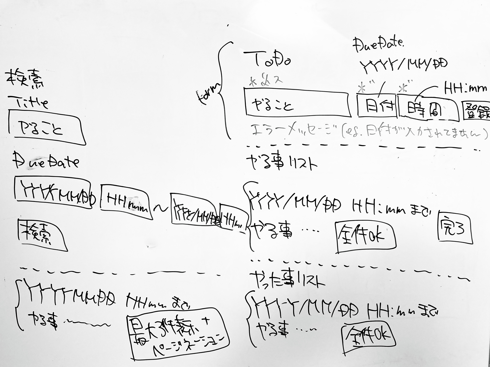

# sandbox-ruby

完成目標

## Todolist
アカウントごとに、自身のタスクを管理することができるサイトです。  
https://pws-sandbox-ruby.herokuapp.com/

  

### アカウント  
- 管理者権限あり
  - email => test@example.com 
  - password => password  
- 管理者権限なし
  - email => test2@example.com
  - password => password  

## 使用技術

- Ruby 2.6.7
- Ruby on Rails 6.1.4.1
- postgreSQL
- TailwindCSS
- slim
- git action
  - RSpecテストの実行
  - Herokuへのデプロイ
- RSpec

## 機能一覧

- ユーザー管理
- ログイン
- Todo管理
- 検索
- ページネーション

## テスト

- RSpec
  - システムテスト(system)
